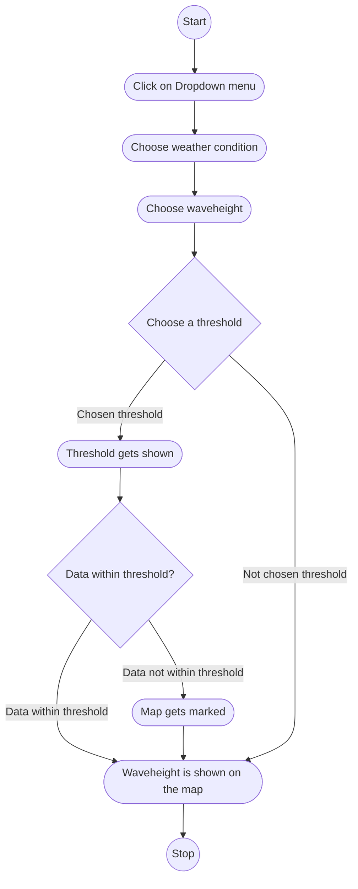
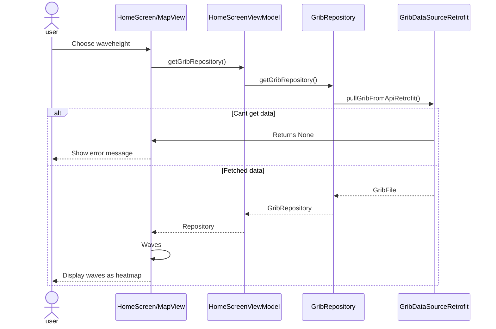

## MODELING

## Use Case Diagram

### Our main use case: "As a user i want to see waveheight displayed on the map"

The most important functions in the app are to display weatherconditions (precipitation, wind, current, wave height). The use case is the same for each condition, so therefore we have just chosen to base our diagrams on the use case waveheight. 

## Activity Diagram
-    Pre-condition: User has opened the app
-    Post-condition: User can see waveheight on the map

Main flow:
1. User clicks on "Værforhold" from the dropdown menu
2. User clicks on "Bølgehøyde" to see waveheight
3. User chooses a threshold
4. The threshold gets shown
5. The data is within the threshold
6. The waveheight is shown on the map as a heatmap

Alternative flow: \
3.1 User doesnt choose a spesific threshold \
3.2 The waveheight is shown on the map as a heatmap 

## Sequence Diagram
**Written explanation**

-    Name: See waveheight on the map
-    Pre-condition: User has opened the app
-    Post-condition: User can see waveheight on the map

Main flow:
1. User chooses waveheight from the dropdown meny
2. The system gets the grib repository from HomeScreenViewModel
3. HomeScreenViewModel gets the grib repository from GribRepository
4. GribRepository gets GRIB data from GribDataSourceRetrofit
5. GRIB data is returned to HomeScreenViewModel/Mapview
6. HomeScreenViewModel/Mapview processes GRIB data into color layers/heatmap based on values
7. Waveheight is displayed on the map

   

Alternative flow:\
5.1 GRIB data is unavailable, the user does not have an internet connection or the API is down

5.2 The system returns NONE

5.3 An error is shown on the screen

## Class diagram

